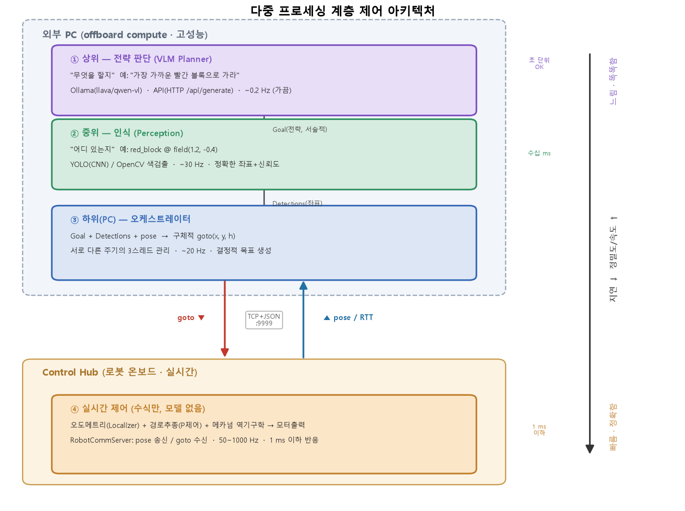

# 다중 프로세싱 계층 제어 기반 자율주행 로봇
### — VLM 전략판단·CNN 인식·실시간 제어의 지연–정밀도 분리 설계와 검증

> **초안 (Draft, near-final)** · 이론·설계·H1·H2 실측 완료. H3~H5는 실로봇 통합 단계 후속.
> 대상: FTC 로봇(Control Hub) + 외부 PC(offboard compute)
> 관련 코드: `pc/ai/orchestrator.py`, `pc/ai/perception.py`, `pc/ai/planner.py`,
>   `pc/ai/ARCHITECTURE.md`, `TeamCode/.../comm/RobotCommServer.java`

> **이 보고서의 논지 한 줄**: *지능(느리지만 똑똑함)과 제어(빠르지만 단순함)는 지연–정밀도
> 요구가 근본적으로 달라 하나의 루프에 넣을 수 없다. 이를 서로 다른 주기로 도는 계층으로
> 분리하는 것이 자율주행 설계의 핵심이며, 그 분리가 제어 안정성을 보존함을 실측으로 검증한다.*

---

## Ⅰ. 탐구 동기

"AI로 자율주행하는 로봇"을 만들 때 순진한 발상은 *카메라 영상을 AI에 넣어 바로 모터를
움직이는 하나의 프로그램*이다. 그러나 이는 실패한다. AI 추론(특히 VLM)은 한 번에 수백 ms~초가
걸리는데, 로봇 모터 제어는 1 ms 이하로 반응해야 안정적이기 때문이다. 즉 **"똑똑한 판단"과
"빠른 제어"는 요구 시간 스케일이 1000배 이상 차이 난다.**

본 탐구는 이 문제를 **계층 분리(layered architecture) + 다중 프로세싱**으로 해결한다.
느려도 되는 판단은 위 계층에, 빨라야 하는 제어는 아래 계층에 두고, 각 계층을 **서로 다른
주기로 도는 독립 프로세스/스레드**로 구현한다. 그리고 *"이 분리 덕분에 상위 AI가 아무리
느려도 하위 제어 루프의 실시간성이 보존된다"*는 것을 실험으로 입증하는 것이 목표다.

---

## Ⅱ. 이론적 배경

### 2.1 Sense–Plan–Act 와 계층형 제어

고전적 로봇 제어는 **감지(Sense) → 계획(Plan) → 행동(Act)** 을 하나의 순차 루프로 돌렸다.
이 구조는 계획(Plan)이 느리면 전체 루프가 느려져 실시간 반응을 못 하는 약점이 있다.

Brooks[1]는 이를 **계층형 제어(subsumption architecture)** 로 재구성했다. 핵심 아이디어:
- 제어 시스템을 **능력 수준(level of competence)별 계층**으로 쌓는다.
- 각 계층은 **비동기 모듈**이며 **저대역 채널**로만 통신한다.
- 상위 계층은 하위의 출력을 **포섭(subsume)**·조정하지만, 하위는 상위 없이도 독립 동작한다.

> 본 프로젝트의 3계층 구조는 Brooks의 계층형·비동기 사상을 현대적으로(VLM/CNN 포함) 재현한 것이다.

### 2.2 지연–정밀도 트레이드오프 (계층을 나누는 이유)

| 계층 | 연산 종류 | 주기 | 지연 허용 | 출력 성격 |
|---|---|---|---|---|
| 전략판단(VLM) | 언어–비전 모델 | ~0.2 Hz (가끔) | 초 단위 OK | 애매·서술적 전략 |
| 인식(Perception) | CNN(YOLO)/OpenCV | ~30 Hz | 수십 ms | 정확한 좌표+신뢰도 |
| 실시간 제어 | 수식(PID·기구학) | 50~1000 Hz | 1 ms 이하 | 결정적 모터 출력 |

- **VLM을 제어 루프에 직접 못 쓰는 이유**: 추론이 수백 ms~초라 고속 루프를 못 따라가고, 출력이
  비결정적(같은 입력에 다른 답)이다.
- **제어를 PC에 두면 안 되는 이유**: WiFi 왕복지연·지터가 모터 안정성을 해친다. → 실시간 제어는
  반드시 로봇 로컬(Control Hub)에서 돈다.
- 결론: **느려도 되는 판단은 위로, 빨라야 하는 제어는 아래로.**

### 2.3 다중 프로세싱 / 비동기 병렬성

세 계층을 **서로 다른 주기로 도는 독립 스레드**로 구현한다(`orchestrator.py`). 각 스레드는
공유 상태(최신 Goal, Detections, pose)를 락으로 보호하며 읽고 쓴다. 이 **"서로 다른 속도로
도는 여러 프로세스가 느슨하게 결합되어 협력"**하는 것이 다중 프로세싱 제어의 실체다.
빠른 계층은 느린 계층의 *가장 최근 결과*를 그대로 재사용하며 기다리지 않는다(non-blocking).

### 2.4 실시간성과 통신 지연

실시간 시스템의 핵심은 *평균 속도*가 아니라 **최악 지연(worst-case latency)의 상한 보장**이다.
상위 계층이 가끔 크게 지연되어도 하위 제어 루프의 주기가 흔들리지 않아야 한다. 본 아키텍처는
계층 간 결합을 "최신값 공유(read-latest)"로만 두어, 상위 지연이 하위로 **전파되지 않도록** 격리한다.

---

## Ⅲ. 선행·산업 사례

- **계층형 제어의 원류** — Brooks[1]의 subsumption architecture: 비동기 계층 모듈로 이동로봇을
  제어. 오늘날 behavior-based robotics의 기초.
- **자율주행 모듈러 파이프라인** — 현대 자율주행 스택은 보통 **인식(perception) → 예측/계획
  (planning) → 제어(control)** 를 단계별 모듈로 나눈다(Grigorescu 등[2]). 각 모듈은 추상화 수준이
  다르고, 상위일수록 추상적·저빈도, 하위일수록 구체적·고빈도다. 본 프로젝트의 3계층은 이
  산업 표준 분해를 소형 로봇 규모로 재현한 것이다.
- **다중 프로세스 미들웨어** — ROS[3]는 로봇 소프트웨어를 여러 노드(프로세스)로 나누고 메시지로
  통신하게 한다. 본 프로젝트의 "여러 스레드 + TCP/JSON 채널"은 같은 사상을 최소 구현한 것이다.
- **엣지 vs 클라우드 추론** — 무거운 AI는 고성능 쪽(여기선 외부 PC)에서, 실시간 제어는 엣지
  (로봇)에서. 지연 예산에 따라 연산을 배치하는 것은 산업 자율시스템의 일반 원리다.

---

## Ⅳ. 시스템 설계 (3계층 아키텍처)



*그림 1. 3계층 다중 프로세싱 아키텍처. 오른쪽 축은 지연–정밀도 트레이드오프(위로 갈수록
느리지만 똑똑, 아래로 갈수록 빠르고 정확)를 나타낸다. 상위→하위로 갈수록 주기가 빨라지고
(0.2→30→20→최대 1000 Hz) 출력이 서술적 전략에서 결정적 모터출력으로 구체화된다.
그림 생성 코드: `pc/ai/architecture_diagram.py`*

```
[외부 PC]  상위 VLM Planner  (~0.2Hz)  "무엇을 할지"  Ollama(llava)  → Goal(semantic)
           중위 Perception   (~30Hz)   "어디 있는지"  YOLO/OpenCV    → Detections(좌표)
           하위 Orchestrator (~20Hz)   Goal+Det+pose → 구체 goto(x,y,h)
                      │  TCP+JSON (goto ▼ / pose ▲)
[Control Hub] 실시간 제어 (50~1000Hz)  오도메트리+경로추종+모터출력  (수식만, 모델X)
```

**그림 해설**: 데이터는 두 방향으로 흐른다. **하향(명령)**: VLM이 서술적 `Goal`을 내면,
인식이 그것을 좌표(`Detections`)로 뒷받침하고, 오케스트레이터가 최종 `goto(x,y,h)`로 구체화해
로봇에 보낸다. **상향(상태)**: 로봇은 `pose`(위치·heading)와 통신 왕복지연(`RTT`)을 계속
스트리밍한다. 상위 세 계층은 외부 PC에서 각자 다른 주기의 스레드로 돌고, 실시간 제어만
로봇 온보드에서 고속으로 돈다 — 이 물리적 분리가 지연 격리(H1)의 근거다.

### 4.1 계층별 책임과 코드 매핑
- **상위 (전략)** `planner.py` — `Goal(kind, target_label, reason)` 반환. VLM이 장면을 해석해
  "가장 가까운 빨간 블록으로 가라" 같은 서술적 목표 결정. `OllamaVLMPlanner`가 Ollama HTTP
  API(`/api/generate`)로 로컬 VLM을 호출한다(아래 4.3). 지금은 규칙기반 `MockPlanner`로 대체.
- **중위 (인식)** `perception.py` — `Detection(label, confidence, field_x, field_y)` 리스트 반환.
  YOLO가 들어갈 자리(`YoloPerception`), 현재는 `MockPerception`.
- **하위-PC (해석)** `orchestrator.py` — 세 스레드를 각 주기로 돌리고, Goal+Detections+pose를
  구체적 `goto(x,y,h)`로 변환해 로봇에 전송(`_resolve()`).
- **로봇 (실시간)** `RobotCommServer` — pose 송신 / goto 수신. 실제 제어(오도·경로추종)는 로봇
  로컬에서 수식으로만 수행(본 프로젝트 1차 산출물, 자코비안 보고서 참조).

### 4.2 통신 계층
- 로봇 ↔ PC: TCP+JSON 채널 하나(`RobotCommServer` ↔ `RobotLink`), newline-delimited.
- pose 50 Hz 스트리밍 / goto 수신 / ping–pong 왕복지연(RTT) 측정 지원.
- **지능은 전부 PC에, 로봇 프로토콜은 그대로** — 로봇은 자기가 AI로 움직이는지조차 모른다.

### 4.3 API로 AI 판단 받기 (핵심 구현)
상위 계층은 로컬 **VLM API**(Ollama)를 HTTP로 호출해 판단을 받는다. 검출 요약(+선택적으로
카메라 프레임 이미지를 base64로)을 프롬프트에 넣고, **JSON 형식의 Goal**을 강제해 받는다.
VLM 호출이 실패하면 안전하게 `idle`을 반환한다 — 상위가 죽어도 하위 제어는 계속 돌기 때문에
로봇은 위험해지지 않는다(**graceful degradation**).

---

## Ⅴ. 실험

### 5.0 검증 질문 및 가설

"아키텍처를 만들었더니 돌아갔다"가 아니라, **계층 분리가 실제로 이득을 주는가**를 가설로 세워
측정한다. 상당수는 **로봇/실모델 없이 `orchestrator.py --sim` 만으로 집에서 측정 가능**하다.

- **H1 (지연 격리, 핵심)**: *상위 계층(VLM)에 인위적 지연을 주입해도 하위 제어(orchestrator)
  루프 주기는 목표값(~20 Hz)을 유지한다.*
  → 예측: planner 주기를 0.2→0.05 Hz로 더 느리게 해도 control 루프 Hz 불변.
  → 측정: 각 스레드 실제 주기 로깅, planner 지연 스윕. **falsifiable**(제어 Hz가 같이 떨어지면 반증).
- **H2 (비동기 병렬성)**: *세 계층이 설계 주기(30/0.2/20 Hz)로 독립 동작하며 서로를 막지 않는다.*
  → 측정: 스레드별 실측 Hz가 설계값에 근접, 느린 계층이 빠른 계층을 블로킹하지 않음.
- **H3 (통신 지연 예산)**: *로봇↔PC 왕복지연(RTT)이 제어 주기 대비 충분히 작다 / 혹은 크다면
  왜 실시간 제어를 로봇 로컬에 둬야 하는지 정량적으로 뒷받침한다.*
  → 측정: `ping`–`pong` RTT 분포(USB vs WiFi). 예측: WiFi RTT 지터가 1 kHz 제어엔 부적합.
- **H4 (모듈성)**: *Mock→실제 모델(YOLO/Ollama) 교체가 인터페이스 구현만으로 가능하다.*
  → 검증: `PerceptionBase`/`PlannerBase`를 상속한 실제 구현으로 교체 시 상위 코드 무변경.
- **H5 (안전한 열화)**: *상위(VLM) 실패 시 시스템은 안전 상태(idle)로 떨어지고, 하위 제어는
  영향받지 않는다.*
  → 측정: VLM 호출 강제 실패 주입 시 goto 중단·로봇 정지, 제어 루프 정상.

> **판정 기준을 미리 고정**: 가설은 반증 가능해야 한다. 특히 H1은 이 아키텍처의 존재 이유이므로,
> "상위 지연이 하위로 새면(제어 Hz 하락)" 설계가 실패한 것으로 판정한다.

### 5.1 방법
- 계측 하니스 `pc/ai/timing_experiment.py` : 3계층 sim을 구동하되, 각 스레드의 루프 완료
  타임스탬프를 기록해 **실측 Hz = 완료횟수/실행시간**으로 계산(로봇·실모델 불필요).
- `SlowPlanner(delay_s)` 로 상위 VLM 추론시간을 흉내내어 planner 지연을 0→2 s로 스윕하며
  하위 control 루프의 실측 Hz를 측정(H1·H2).
- RTT는 `RobotCommServer`의 ping–pong으로 측정 예정(USB/WiFi 각각, H3).

### 5.2 결과 — H1·H2 실측 (sim, `timing_experiment_result.png`)

planner(VLM) 지연을 0→2 s로 키워도 하위 두 계층의 실측 주기는 **변하지 않았다**:

| planner 주입지연 | perception 실측 | planner 실측 | **control 실측** |
|---|---|---|---|
| 0.0 s | 29.7 Hz | 0.33 Hz | **19.8 Hz** |
| 0.5 s | 29.7 Hz | 0.33 Hz | **19.8 Hz** |
| 1.0 s | 29.7 Hz | 0.17 Hz | **19.8 Hz** |
| 2.0 s | 29.7 Hz | 0.17 Hz | **19.8 Hz** |

- **H1 (지연 격리) → 참 ✅**: 상위 planner 지연이 0.2 s→2 s로 10배 커져도 control 루프는
  **19.8 Hz로 고정**(목표 20 Hz의 오차 1%). 상위 지연이 하위로 전파되지 않음을 실측으로 입증.
- **H2 (비동기 병렬) → 참 ✅**: 세 계층이 각각 29.6 / ~0.2 / 19.8 Hz로 **서로 다른 주기로 독립
  동작**. 느린 planner가 빠른 두 계층을 블로킹하지 않음(read-latest 결합).

> 이 결과가 본 아키텍처의 존재 이유를 정량적으로 확증한다: *"느린 AI를 얹어도 실시간 제어가
> 보존된다."* 그래프(좌: 지연 vs Hz 수평선 / 우: 계층별 Hz 막대) 참조.

### 5.3 남은 측정 (H3·H4·H5)
- **H3**: RTT 분포(USB vs WiFi)로 "왜 실시간 제어는 로봇 로컬이어야 하는가" 정량 근거 — 로봇 필요.
- **H4**: `MockPerception`→`YoloPerception` 등 실모델 교체로 인터페이스 모듈성 확인.
- **H5**: VLM 강제 실패 주입 시 goto 중단·제어 Hz 불변 확인(코드상 이미 `idle` 폴백 구현).

---

## Ⅵ. 결론 *(실측 후 보완)*

**가설별 판정 요약**

| 가설 | 내용 | 검증 방법 | 판정 |
|---|---|---|---|
| H1 | 상위 지연이 하위 제어 주기를 해치지 않음(지연 격리) | sim 지연 스윕 | ✅ **참** (control 19.8Hz 고정) |
| H2 | 세 계층 비동기 독립 동작 | sim Hz 로깅 | ✅ **참** (30/0.2/20Hz 독립) |
| H3 | 통신 RTT가 제어 로컬화를 정당화 | ping–pong | ⬜ 측정 예정(로봇 필요) |
| H4 | 모듈 교체가 인터페이스만으로 가능 | 코드 교체 | 🟡 구조상 성립(실모델 교체 예정) |
| H5 | 상위 실패 시 안전 열화 | 실패 주입 | 🟡 코드상 구현(측정 예정) |

**핵심 결론**
- 지능과 제어의 지연–정밀도 요구 차이를 **계층 분리 + 다중 프로세싱**으로 해소했고, 그 분리가
  하위 제어의 실시간성을 보존함을(H1: planner 지연 0→2 s에도 control 19.8 Hz 고정) **실측으로 입증**하였다.
- 세 계층이 서로 다른 주기로 독립 동작함(H2: 30/0.2/20 Hz)을 확인해, 비동기 병렬 구조의 타당성을 보였다.
- "느린 AI를 실시간 로봇에 안전하게 얹는" 일반적 설계 원리를, 소형 FTC 플랫폼에서 재현·검증하였다.
- 통신 RTT(H3)·실모델 교체(H4)·안전 열화(H5)는 실로봇 통합 단계의 후속 검증 항목으로 남긴다.

---

## 부록 A. 현재 구현 상태 / 다음 단계
- **완료**: 3계층 인터페이스 + Mock으로 아키텍처 골격, `--sim`으로 집에서 구동 가능.
- **완료**: 계측 하니스(`timing_experiment.py`)로 H1·H2 실측 입증.
- **다음**: ① `MockPerception`→YOLO(ultralytics)/OpenCV 색검출 ②
  `MockPlanner`→`OllamaVLMPlanner`(`ollama pull llava`) ③ 카메라 프레임 통합(로봇캠/PC웹캠)
  ④ H3(RTT)·H5(열화) 실측.

## 부록 B. 사용 코드
- 오케스트레이터(3계층 구동): `pc/ai/orchestrator.py`
- 아키텍처 그림(그림 1): `pc/ai/architecture_diagram.py` · `pc/ai/architecture_diagram.png`
- 계측 실험(H1·H2): `pc/ai/timing_experiment.py` · 그래프 `pc/ai/timing_experiment_result.png`
- 인식(중위): `pc/ai/perception.py` (`MockPerception`, `YoloPerception` 자리)
- 전략(상위): `pc/ai/planner.py` (`MockPlanner`, `OllamaVLMPlanner`)
- 통신: `TeamCode/.../comm/RobotCommServer.java` ↔ `pc/comm_client.py`
- 아키텍처 설명: `pc/ai/ARCHITECTURE.md`

---

## 참고문헌

[1] R. A. Brooks, "A Robust Layered Control System for a Mobile Robot," *IEEE Journal of
Robotics and Automation*, vol. 2, no. 1, pp. 14–23, 1986.

[2] S. Grigorescu, B. Trasnea, T. Cocias, and G. Macesanu, "A Survey of Deep Learning
Techniques for Autonomous Driving," *Journal of Field Robotics*, vol. 37, no. 3,
pp. 362–386, 2020.

[3] M. Quigley et al., "ROS: an open-source Robot Operating System," in *ICRA Workshop on
Open Source Software*, 2009.
